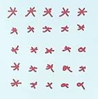
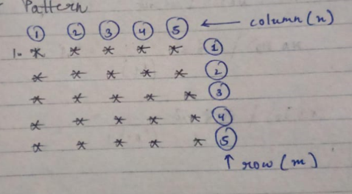

# Pattern_01


After analysing the above pattern we can the approach we come with is to divide this pattern into rows and column.



Code:
```cpp
#include<iostream>
using namespace std;
int main(){
    int n=5,m=5;
    for(int i =0 ; i< m; i++){
        for(int j = 0 ; j<n ; j++){
            cout<<"* ";
        }
        cout<<endl;
    }
    return 0;
}
```
