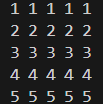

# Pattern_02
<br>

### Approach:
=> In each row, the number printed is equal to the current row number. The first row contains five 1s, the second row contains five 2s, and so on until the fifth row.

=> The inner loop repeats the row number five times, and after that, a new line is printed to start the next row.


### Code:
```cpp
#include<iostream>
using namespace std;
int main(){
    int row=5,col=5;
    for(int i=1; i<=row ; i++){
        for(int j = 1; j<=col ; j++){
            cout<<i<<" ";
        }
        cout<<endl;
    }
    return 0;
}
```