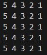
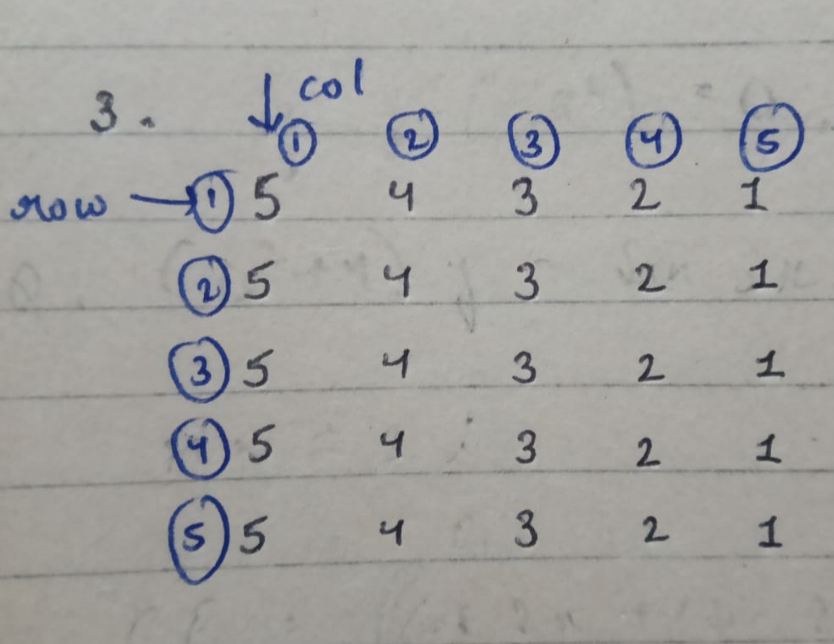

# Pattern_03


### Approach:
<br>

 => The outer loop runs 5 times, corresponding to the 5 rows of the pattern. For each iteration of the outer loop, the inner loop prints numbers in reverse order, starting from 5 down to 1, for each of the 5 columns in the row. <br>
 => After printing each row, a new line is added using cout << endl to move to the next row. This logic repeats for all 5 rows, resulting in the pattern where each row contains the numbers 5 4 3 2 1.

### Code:
```cpp
#include<iostream>
using namespace std;
int main(){
    int row=5,col=5;
    for(int i=1; i<=row ; i++){
        for(int j = col; j>=1 ; j--){
            cout<<j<<" ";
        }
        cout<<endl;
    }
    return 0;
}
```