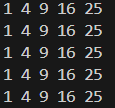
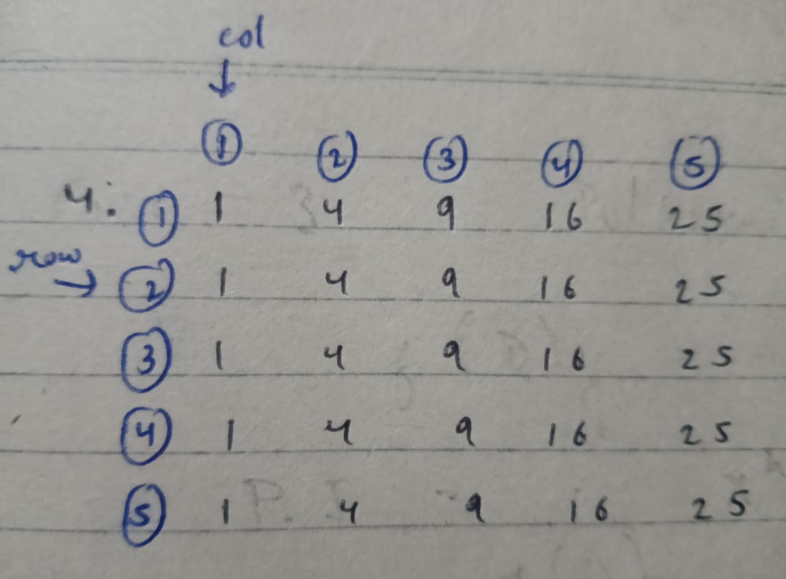

# Pattern_04


### Approach:


=> The logic behind this code is as follows:

1. The outer loop runs 5 times (one for each row), as controlled by the row = 5.
2. The inner loop also runs 5 times (one for each column), as controlled by col = 5.
3. Inside the inner loop, the code prints the square of the column number (j * j). For each iteration of the inner loop, it calculates the square of j (i.e., 1^2, 2^2, 3^2, etc.) and prints it.
4. After printing all the squares in one row, the cout << endl; moves to the next line to start printing the next row.
5. This process repeats until all 5 rows are printed, each containing the squares of the numbers from 1 to 5.

### Code:

```cpp
#include<iostream>
using namespace std;
int main(){
    int row=5,col=5;
    for(int i=1; i<=row ; i++){
        for(int j = 1; j<=col ; j++){
            cout<<(j*j)<<" ";
        }
        cout<<endl;
    }
    return 0;
}
```