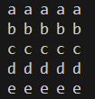
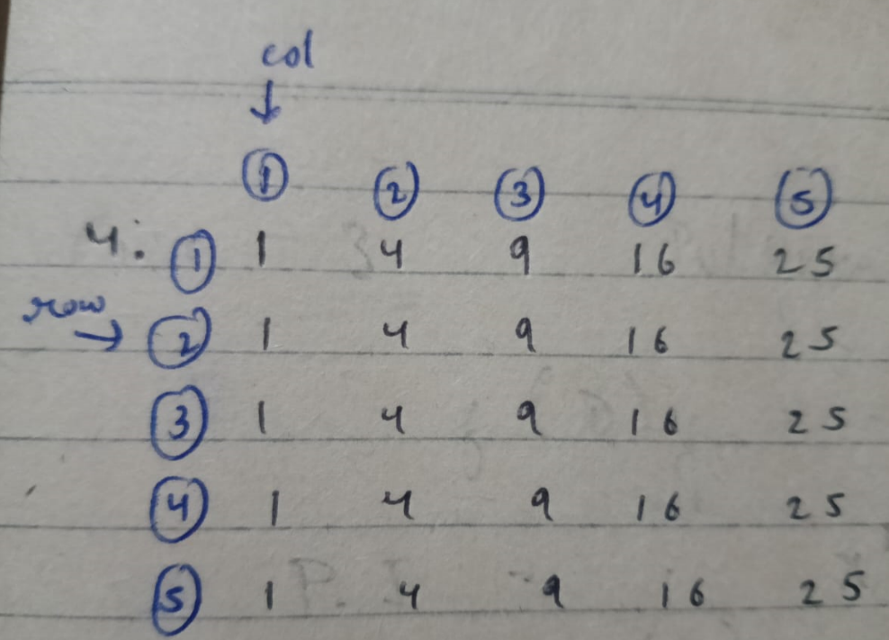

# Pattern_05


### Approach
<br>

### Logic:
1. The outer loop runs 5 times (for 5 rows).
2. In each iteration of the outer loop, the character printed is determined by adding the row index i to the ASCII value of 'a' (starting from 'a' for i = 0).
3. The inner loop runs 5 times (for 5 columns), printing the same character in each column of the row.
4. After printing the character in each column, a space is added between them.
5. After completing each row, a newline (endl) is printed to move to the next row.
6. This process repeats for all 5 rows, with each row printing the next letter in the alphabet.

### Code:
```cpp
#include<iostream>
using namespace std;
int main(){
    int row=5,col=5;
    for(int i=0; i<row ; i++){
        char name = 'a'+i;
        for(int j = 0; j<col ; j++){
            cout<<name<<" ";
        }
        cout<<endl;
    }
    return 0;
}
```