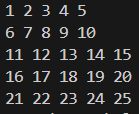
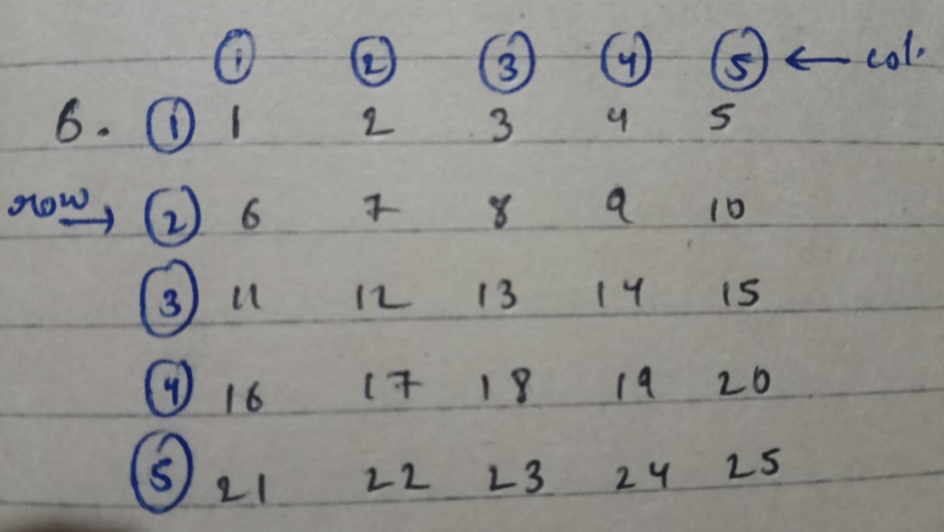

# Pattern_06


### Approach:
<br>

### Logic:

1. row = 5, col = 5, and count = 0 are initialized, where row and col represent the number of rows and columns, and count tracks the number to print.
2. The outer loop runs 5 times (for 5 rows).
3. The inner loop also runs 5 times (for 5 columns), printing a number in each iteration.
4. In each iteration of the inner loop, count++ increments the count variable, starting from 1 and going up sequentially.
5. After printing each number, a space is added to separate the numbers in the same row.
6. Once the inner loop finishes for a row, cout << endl; moves the cursor to the next line.
7. The process repeats until all rows are printed, resulting in a 5x5 grid of numbers from 1 to 25.

### Code:

```cpp
#include<iostream>
using namespace std;
int main(){
    int row=5,col=5,count=0;
    for(int i=0; i<row ; i++){
        for(int j = 0; j<col ; j++){
            count++;
            cout<<count<<" ";
        }
        cout<<endl;
    }
    return 0;
}
```