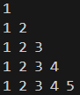

# Pattern_07


### Logic:
1. Outer Loop (Row Loop):<br>
    ```
    for(int row = 1; row <= 5; row++) {
    ```

    - The outer loop controls the number of rows in the pattern.
    - row starts at 1 and increments up to 5, so there are 5 rows in the output.

2. Inner Loop (Column Loop):

    ```
    for(int col = 1; col <= row; col++) {
    ```
    - The inner loop controls the number of columns to print in each row.
    - The condition col <= row ensures that the number of columns in each row equals the current row number (row).
   - For example:<br>
For row = 1, col runs from 1 to 1 → 1 column.
For row = 2, col runs from 1 to 2 → 2 columns.
This pattern continues for subsequent rows.
3. Printing Values:

    ```
    cout << col << " ";
    ```
    - The value of col is printed for each column in the current row, followed by a space.

4. Newline After Each Row:
    ```
    cout << endl;
    ```
    - After printing all the columns in a row, a newline character is printed to move to the next row.
5. Program Output: <br>The nested loops result in a triangular pattern where:

    - The first row contains 1 number.
    - The second row contains 2 numbers.
    - The third row contains 3 numbers, and so on.

### Code:
```cpp
#include<iostream>
using namespace std;
int main(){
    for(int row =1; row<=5 ; row++){
        for(int col = 1; col<=row ; col++){
            cout<<col<<" ";
        }
        cout<<endl;
    }
    return 0;
}
```