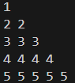

# Pattern_08


### Logic:
This program prints a pattern where each row contains the same number repeated, and the number corresponds to the current row number. Here's the step-by-step explanation of the logic:

---

### Code Explanation

1. **Outer Loop (Row Loop):**
   ```cpp
   for(int row = 1; row <= 5; row++) {
   ```
   - The outer loop controls the number of rows in the pattern.
   - `row` starts at 1 and increments up to 5, so there are 5 rows in the output.

2. **Inner Loop (Column Loop):**
   ```cpp
   for(int col = 1; col <= row; col++) {
   ```
   - The inner loop controls how many numbers to print in each row.
   - The condition `col <= row` ensures that the number of columns in each row equals the current row number (`row`).

3. **Printing the Row Number:**
   ```cpp
   cout << row << " ";
   ```
   - The value of `row` (the current row number) is printed repeatedly for each column in that row.
   - For example:
     - For `row = 1`, the inner loop runs once and prints `1`.
     - For `row = 2`, the inner loop runs twice and prints `2 2`.
     - This pattern continues for subsequent rows.

4. **Newline After Each Row:**
   ```cpp
   cout << endl;
   ```
   - After printing all the numbers in a row, a newline character is added to move to the next row.

---

### Program Output

The output of the program will be:

```
1
2 2
3 3 3
4 4 4 4
5 5 5 5 5
```

---

### Key Points
- The **outer loop** determines the row number and how many times the inner loop will execute.
- The **inner loop** prints the current `row` number as many times as the row number itself.
- Each row has the same number printed repeatedly, and the number of repetitions increases with the row number.
### Code:
```cpp
#include<iostream>
using namespace std;
int main(){
    for(int row =1; row<=5 ; row++){
        for(int col = 1; col<=row ; col++){
        cout<<row<<" ";
        }
        cout<<endl;
    }
    return 0;
    }
``` 