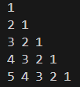

# Pattern_09


### Logic:
This program prints a pattern where each row contains numbers in descending order, starting from the current row number and decreasing to 1. Here's the step-by-step explanation of the logic:

---

### Code Explanation

1. **Outer Loop (Row Loop):**
   ```cpp
   for(int row = 1; row <= 5; row++) {
   ```
   - The outer loop determines the number of rows in the pattern.
   - `row` starts at 1 and increments up to 5, so there are 5 rows in the output.

2. **Inner Loop (Column Loop):**
   ```cpp
   for(int col = row; col >= 1; col--) {
   ```
   - The inner loop prints numbers for the current row in descending order.
   - The variable `col` starts from the current `row` number and decrements down to 1.
   - For example:
     - For `row = 1`, `col` runs from 1 to 1 → prints `1`.
     - For `row = 2`, `col` runs from 2 to 1 → prints `2 1`.
     - For `row = 3`, `col` runs from 3 to 1 → prints `3 2 1`.
     - This pattern continues for subsequent rows.

3. **Printing Values:**
   ```cpp
   cout << col << " ";
   ```
   - The current value of `col` is printed during each iteration of the inner loop.

4. **Newline After Each Row:**
   ```cpp
   cout << endl;
   ```
   - After completing the inner loop for one row, a newline character is printed to move to the next row.

---

### Program Output

The output of the program will be:

```
1
2 1
3 2 1
4 3 2 1
5 4 3 2 1
```

---

### Key Points
- The **outer loop** determines the row number and sets the starting value for the inner loop (`col`).
- The **inner loop** prints numbers in descending order, starting from the current row number (`row`) and decrementing to 1.
- Each row starts from its row number and decreases to 1, resulting in the desired pattern.
### Code:
```cpp
#include<iostream>
using namespace std;
int main(){
    for(int row =1; row<=5 ; row++){
        for(int col = row; col>=1 ; col--){
            cout<<col<<" ";
        }
        cout<<endl;
    }
    return 0;
}
```