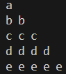

# Pattern_10


### Logic:
This program prints a pattern of lowercase letters based on the ASCII value of characters. The letters correspond to the current row, and each letter is repeated for the number of columns in that row. Here's a detailed explanation of the logic:

---

### Code Explanation

1. **Outer Loop (Row Loop):**
   ```cpp
   for(int row = 0; row < 5; row++) {
   ```
   - The outer loop controls the number of rows in the pattern.
   - `row` starts at `0` and increments up to `4` (total 5 rows).

2. **Inner Loop (Column Loop):**
   ```cpp
   for(int col = 0; col <= row; col++) {
   ```
   - The inner loop determines how many times a character is printed in each row.
   - The condition `col <= row` ensures that the number of columns in each row equals the current `row + 1`.
   - For example:
     - For `row = 0`, `col` runs from `0` to `0` → 1 column.
     - For `row = 1`, `col` runs from `0` to `1` → 2 columns.
     - This pattern continues for subsequent rows.

3. **Character Calculation:**
   ```cpp
   cout << char('a' + row) << " ";
   ```
   - `'a'` is the ASCII value of the lowercase letter 'a' (97 in decimal).
   - Adding `row` to `'a'` gives the ASCII value of the letter corresponding to the current row.
     - For `row = 0`, `'a' + 0` → 'a'.
     - For `row = 1`, `'a' + 1` → 'b'.
     - For `row = 2`, `'a' + 2` → 'c'.
   - This letter is then converted back to a character using `char()` and printed.

4. **Newline After Each Row:**
   ```cpp
   cout << endl;
   ```
   - After completing the inner loop for one row, a newline character is printed to move to the next row.

---

### Program Output

The output of the program will be:

```
a
b b
c c c
d d d d
e e e e e
```

---

### Key Points
1. The **outer loop** determines the row number and the letter to be printed in that row.
2. The **inner loop** determines how many times the letter is printed in each row, based on the row number.
3. The character is calculated by adding the row number to the ASCII value of 'a' and then converting it back to a character.
4. Each row contains the same letter repeated, with the number of repetitions equal to the row number plus one.
### Code:
```cpp
#include<iostream>
using namespace std;
int main(){
    for(int row =0; row<5 ; row++){
        for(int col = 0; col<=row ; col++){
            cout<<char('a'+row)<<" ";
        }
        cout<<endl;
    }
    return 0;
}
```