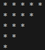

# Pattern_11


### Logic:
This program prints an inverted right-angled triangular pattern of asterisks (`*`). Here's a detailed explanation of the logic:

---

### Code Explanation

1. **Outer Loop (Row Loop):**
   ```cpp
   for(int row = 5; row >= 0; row--) {
   ```
   - The outer loop determines the number of rows and the number of `*` to print in each row.
   - `row` starts at `5` (indicating 5 stars in the first row) and decrements to `0` (indicating 0 stars in the last "row").

2. **Inner Loop (Column Loop):**
   ```cpp
   for(int col = 1; col <= row; col++) {
   ```
   - The inner loop controls the number of asterisks to print in the current row.
   - The condition `col <= row` ensures that the number of columns (and thus the number of `*` printed) matches the current value of `row`.
   - For example:
     - When `row = 5`, `col` runs from `1` to `5` → 5 stars printed.
     - When `row = 4`, `col` runs from `1` to `4` → 4 stars printed.
     - This pattern continues until `row = 0`, where no stars are printed.

3. **Printing the Asterisks:**
   ```cpp
   cout << "* ";
   ```
   - During each iteration of the inner loop, an asterisk (`*`) followed by a space is printed.

4. **Newline After Each Row:**
   ```cpp
   cout << endl;
   ```
   - After completing the inner loop for one row, a newline character is printed to move to the next row.

---

### Program Output

The output of the program will be:

```
* * * * * 
* * * * 
* * * 
* * 
* 
```

---

### Key Points
1. The **outer loop** determines the number of rows and controls how many times the inner loop runs.
2. The **inner loop** prints `*` for the current row, with the number of `*` equal to the value of `row`.
3. The pattern starts with 5 stars in the first row and decreases by 1 star for each subsequent row until no stars are printed in the last row.

This program effectively creates a downward-sloping triangular pattern of asterisks.
### Code:
```cpp
#include<iostream>
using namespace std;
int main(){
    for(int row =5; row>=0 ; row--){
        for(int col = 1; col<=row ; col++){
            cout<<"* ";
        }
        cout<<endl;
    }
    return 0;
}
```