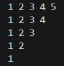

# Pattern_12


### Logic:
This program prints an inverted right-angled triangular pattern of numbers, where each row contains numbers in ascending order starting from 1. Here's a detailed explanation of the logic:

---

### Code Explanation

1. **Outer Loop (Row Loop):**
   ```cpp
   for(int row = 5; row >= 0; row--) {
   ```
   - The outer loop controls the number of rows in the pattern.
   - `row` starts at `5` (indicating the maximum number of columns in the first row) and decrements down to `0` (indicating 0 columns in the last "row").

2. **Inner Loop (Column Loop):**
   ```cpp
   for(int col = 1; col <= row; col++) {
   ```
   - The inner loop controls the numbers printed in the current row.
   - The condition `col <= row` ensures that the numbers printed in each row go from `1` up to the value of the current `row`.
   - For example:
     - When `row = 5`, `col` runs from `1` to `5` → prints `1 2 3 4 5`.
     - When `row = 4`, `col` runs from `1` to `4` → prints `1 2 3 4`.
     - This pattern continues until `row = 0`, where no numbers are printed.

3. **Printing Numbers:**
   ```cpp
   cout << col << " ";
   ```
   - During each iteration of the inner loop, the value of `col` (ranging from `1` to `row`) is printed, followed by a space.

4. **Newline After Each Row:**
   ```cpp
   cout << endl;
   ```
   - After completing the inner loop for one row, a newline character is printed to move to the next row.

---

### Program Output

The output of the program will be:

```
1 2 3 4 5 
1 2 3 4 
1 2 3 
1 2 
1 
```

---

### Key Points
1. The **outer loop** determines the row number and the maximum number (`row`) printed in each row.
2. The **inner loop** prints numbers from `1` to the current `row` value in ascending order.
3. The pattern starts with 5 numbers in the first row and decreases by 1 number in each subsequent row until no numbers are printed in the last row.

This program creates an inverted triangular pattern of numbers, with each row starting from `1` and ending at the current row number.

### Code:
```cpp
#include<iostream>
using namespace std;
int main(){
    for(int row =5; row>=0 ; row--){
        for(int col = 1; col<=row ; col++){
            cout<<col<<" ";
        }
        cout<<endl;
    }
    return 0;
}
```